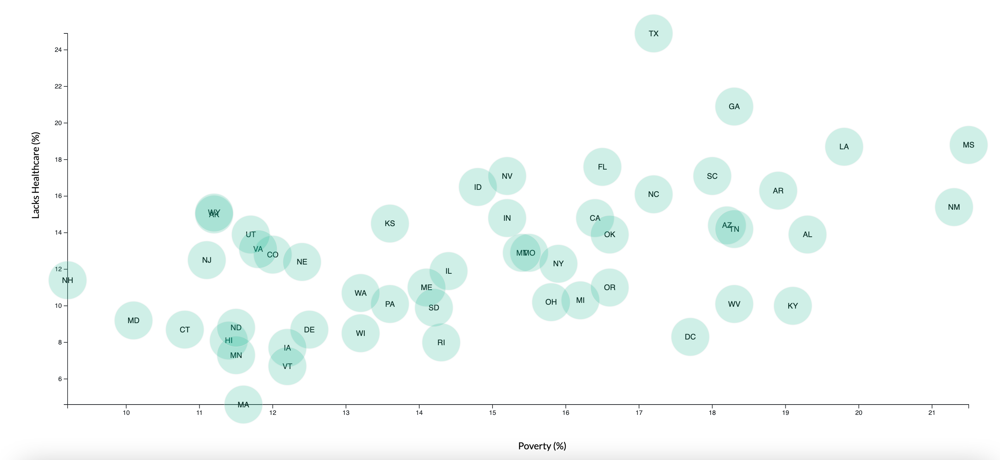

# Data Journalism and D3

### https://alexarnold630.github.io/SMU_Homework/16-D3/Submission/StarterCode/index.html

## Background
Tasked with analyzing the current trends shaping people's lives, as well as creating charts, graphs, and interactive elements to help readers of a major metro paper understand your findings.

## Technologies Used
- d3.js
- HTML/CSS
- Javascript

## Objectives
- Create a scatter plot using D3 techniques that represents states with circle elements
- Incorporate tooltip to reveal a specific element's data

## Data
Based on the 2014 ACS 1-year estimates from the US Census Bureau
https://data.census.gov/cedsci/

